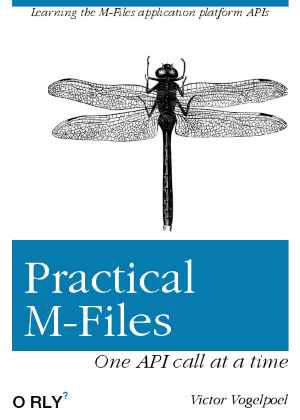
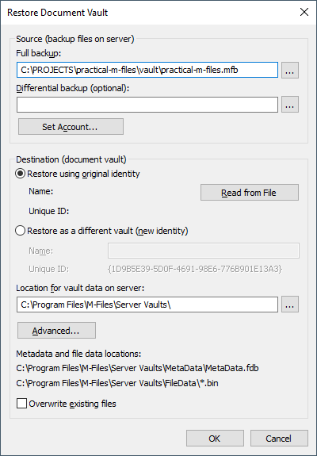
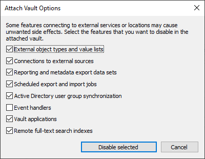
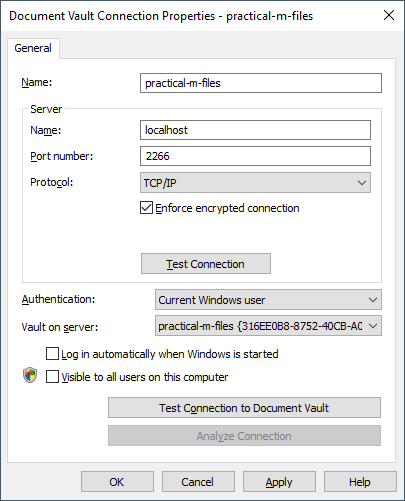

# practical-m-files<!-- omit in toc -->

Practical samples of M-Files COM and REST API that you can use.

If you are a developer and building solutions and integrations with M-Files, the Intelligent document and information management system, you've found the M-Files application platform reference documentation some what lacking, as I did.

In my quest in learning the M-Files applications platform, `practical-m-files` is my write-up of simple applications with the M-Files APIs and some proposals for lacking features, like using Serilog for logging in vault application.

## Table of contents <!-- omit in toc -->

- [Requirements](#requirements)
- [Getting started](#getting-started)
  - [Clone this repository to your harddisk](#clone-this-repository-to-your-harddisk)
  - [Restore the supplied sample vault `practical-m-files`](#restore-the-supplied-sample-vault-practical-m-files)
  - [Add M-Files Desktop App settings for the sample vault](#add-m-files-desktop-app-settings-for-the-sample-vault)
  - [Open a sample project in Visual Studio (Code) and run](#open-a-sample-project-in-visual-studio-code-and-run)
- [Practical M-Files samples](#practical-m-files-samples)

## Requirements

To open and run the samples from `practical-mfiles`, you'll need the following software and frameworks:

- M-Files Online Full Installation with M-Files Desktop, M-Files Server and M-Files Server tools.
- Microsoft Visual Studio 2019 or Microsoft Visual Studio Code with C#.
- .NET Full framework 4.x en .NET 5.x.

## Getting started

The practical-m-files samples work with a local sample vault, called `practical-m-files`, that you can find in the [/vault](./tree/main/vault) folder.

### Clone this repository to your harddisk

TODO

### Restore the supplied sample vault `practical-m-files`

Use these instructions to import the sample `practical-m-files.mfb` vault:

1. Git clone this repository to your harddisk
1. Start MF Admin
1. Go to the `Local Computer\Document Vaults` node.
1. Right click the `Document Vaults` node and choose `Restore Document Vault'.
  
    
    - In `Full backup` enter the path to `practical-m-files.mfb`.
    - Make sure you select `Restore using the original identity`.
    - Click `OK`.
    - In the `Attached Vault Options` dialog, only `Event Handlers` is unselected and click `Disable selected`.
     
    - In the `Attached Vault` dialog, click `Attach` and the vault is imported.

1. Open the `practical-m-files` vault to `Users` and click 'New User' to add your Windows login account to the vault.

     - In the `Login account` dropdown, choose your M-Files Windows account.
     - In the `Administrative rights in vault` section, select 'Full control of vault'.
     - Click `OK` to create the user.

### Add M-Files Desktop App settings for the sample vault

Create a M-Files Desktop settings entry.

1. In the Windows traybar, right click the M-Files icon and choose `Settings`, M`-Files Desktop settings`
1. Click `Add...` and enter connection settings.

    

   - In `Name`, enter '`practical-m-files' .
   - In the server section, enter `Localhost` in `Name`, `2266` with `Port number` and protocol TCP/IP.
   - Choose `Current Windows user` with Authentication.
   - Pick `practical-m-files` in the `Vault on server` dropdown.
   - Click `OK` to complete the vault connection settings..

### Open a sample project in Visual Studio (Code) and run

## Practical M-Files samples

Theres are a lot of samples. Click in the code panel to go to the sample source code.
