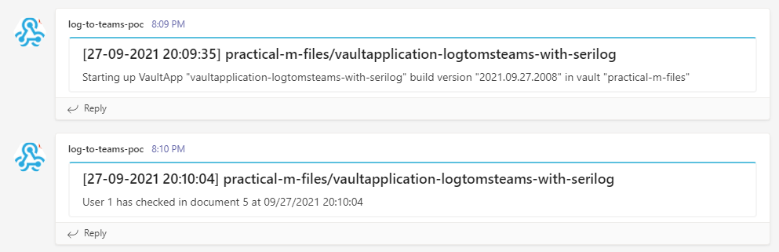

# vaultapplication-logtomsteams-with-serilog

This sample Vault Application demonstraties logging to an Microsoft Teams channel with an incoming webhook connector through Serilog structured logging using a somewhat downgraded and mangled Serilog.Sinks.MicrosoftTeams.Alternative package.
Each logging statement now produces an "card" entry in the Microsoft Teams channel



NOTE: I copied the Serilog.Sinks.MicrosoftTeams.Alternative source code and replaced the Newtonsoft.Json 13.x code for JSON serialization with UTF8Json code. The VAF uses Newtonsoft.Json 10.x and that clashes with the version in the Serilog.Sinks.MicrosoftTeams.Alternative source.

## Getting this sample vault application to work

You'll have to create an incoming webhook connector on a channel in your Microsoft Teams environment. See here on how to do that and to get the uri to that webhook. You must place that webhook uri in the vaultapplication.cs code at the sink's logger builder.
[https://docs.microsoft.com/en-us/microsoftteams/platform/webhooks-and-connectors/how-to/add-incoming-webhook](https://docs.microsoft.com/en-us/microsoftteams/platform/webhooks-and-connectors/how-to/add-incoming-webhook)

The webhook uri is of form: "https://[TENANT].webhook.office.com/webhookb2/[SOMEGUID]@[SOMEGUID2]/IncomingWebhook/[SOMEGUID3]/[SOMEGUID4]"


```csharp
// Configure logging
Log.Logger = new LoggerConfiguration()
    .MinimumLevel.ControlledBy(_loggingLevelSwitch)

    .Enrich.WithProperty("Customer", "SomeCustomer")

    // TODO: REPLACE first argument with a uri of a incoming webhook connector to your own MS Teams channel.
    // SEE the instructions on this page for creating the incoming webhook connector and getting the uri to place here:
    // https://docs.microsoft.com/en-us/microsoftteams/platform/webhooks-and-connectors/how-to/add-incoming-webhook
    .WriteTo.MicrosoftTeams("https://[TENANT].webhook.office.com/webhookb2/[SOMEGUID]@[SOMEGUID2]/IncomingWebhook/[SOMEGUID3]/[SOMEGUID4]"
                            titleTemplate: "[{Timestamp:dd-MM-yyyy HH:mm:ss}] practical-m-files/vaultapplication-logtomsteams-with-serilog",
                            omitPropertiesSection: true)

    .CreateLogger();

```

When configured correctly, each document object checkin will be logged to the Microsoft Teams channel.
